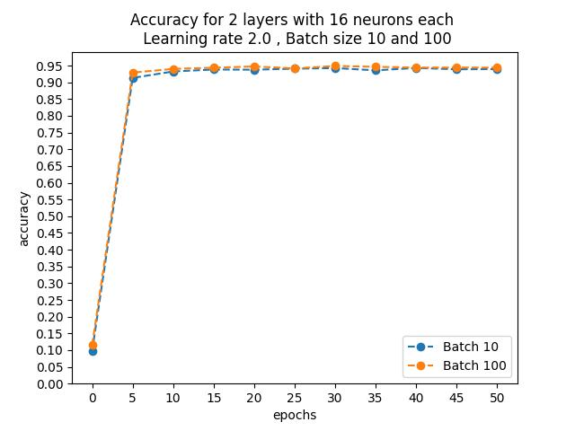
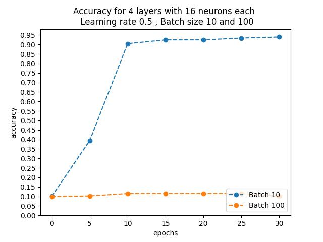

# Lab 5 - Perceptron wielowarstwowy

*Jan Kowalczewski, Jakub Woźniak*

## <u>Decyzje projektowe</u>

Perceptron Wielowarstwowy wytrenowany do klasyfikacji zbioru danych MNIST (http://yann.lecun.com/exdb/mnist/). 

### Algorytm Stochistic Gradient Descent

Szkolimy wagi i biasy dla kolejnych serii danych. Aktualizując je o gradien dla danej serii.

### Funkcja aktywacji

Jako funkcje aktywacji zdecydowaliśmy się wykorzystać funkcje sigmoidalną "1 / (1 + np.exp(-x))"

### Funkcja celu

Jako funkcje celu wykorzystujemy funckje "np.sum((x - y)**2)"

## <u>Cel ćwiczenia</u>

Celem ćwiczenia jest implementacja perceptronu wielowarstwowego oraz wybra-
nego algorytmu optymalizacji gradientowej z algorytmem propagacji wstecznej. A także wytrnowanie preceptronu i przetestowanie go dla zbioru testowego.

## <u>Przebieg ćwicznia</u>

W ramach ćwicznia trenujemy perceptron na zbiorze trenigowym zawierającym 48 000 obrazków w rozmiarach 28x28 z jedną warstwą chromatyczną. Klasa NeuralNetworkSolver przyjmuje kolejno tabele intów w których każdy int reprezentuje jedną warstę a jego wartość liczbe neuronów w tej warstwie, funkcje aktywacji, funkcje kosztu, "learing rate", wielkość serii oraz ilość epoch.

A następnie sprawdzamy jego celność przewidywań dla zbioru walidacyjnego, z jego pomocą dostosowujemy hiperparametry klasy tak aby osiągnąć jak najlepsze wyniki.

 ## <u>Przykładowy wygląd obrazków jakie rozpoznawać będzie nasz algorytm</u>
  

## <u>Wykresy dla niektórych parametrów</u>

Wykres 1 - Poprawność przewidywań dla 2 warstw po 16 neuronów każda  dla "learnign rate" 0.1 i wiekości seri 10 oraz 100 

Wykres 2 - Poprawność przewidywań dla 2 warstw po 32 neuronów każda  dla "learnign rate" 0.1 i wiekości seri 10 oraz 100 

Wykres 3 - Poprawność przewidywań dla 2 warstw po 16 neuronów każda  dla "learnign rate" 2.0 i wiekości seri 10 oraz 100 

Wykres 4 - Poprawność przewidywań dla 4 warstw po 16 neuronów każda  dla "learnign rate" 0.5 i wiekości seri 10 oraz 100 

## <u>Wnioski</u>

Poprawność przewidywania algorytmu jest zależna od wielu hiperparametrów jednak niektóre z nich mają na nią większy wpływ niż inne, tak jak np. rozmiar seri znacząco wpływa na to jak szybko osiągamy wysoką skuteczność przewidywania ale jendocześnie jeżeli dobierzemy odpowiedni "learning rate" to jesteśmy w stanie zniwelować negatywne skutki większego rozamiaru seri. Dodatkowo możemy zauważyć że zwiększanie liczby epoch daje nam coraz mniejszy zysk z tym samym kosztem czasu a więc nalezy się zastanowić czy jest sens podawać sieci neuronowej duże wartości epoch. Jeżeli chodzi o ilość neurnów na warstwe to sytuacja ma się tak samo jak z epochami od pewnego momentu zwiększanie ich lości daje bardzo mały zysk a znacząco zwiększa czas wykonywania się operacji.
